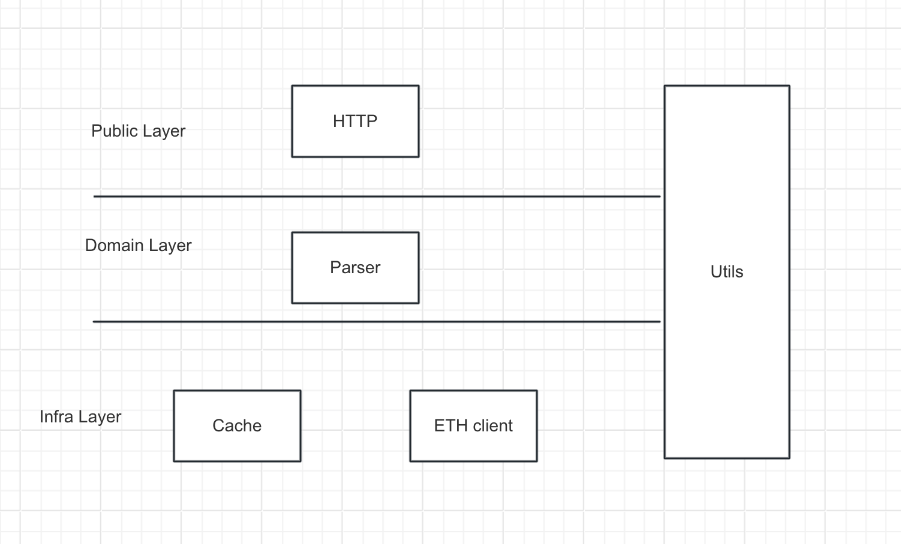

## Goal
Implement Ethereum blockchain parser that will allow to query transactions for subscribed addresses.

## Usage

### 1. start the server
~~~cmd
   go build && ./ethereum-parser  
~~~

### 2. api
#### 2.1 get current block
* method: GET 
* path: 127.0.0.1:9090/CurrentBlock
* excepted response: `{"message":"success","data":{"currentBlock":19953725}}`

#### 2.2 subscribe address
* method: GET
* path: 127.0.0.1:9090/Subscribe?address=0x2c937e3b0ea4198303d85ae11e4ac5fe3181c990
* excepted response: `{"message":"success","data":{"subscribed":"true"}}`

then you can check the trans information of subscribers by server logs, such as:

`
2024/05/26 20:56:07 [subscribe] attention, subscribed user:[0x2c937e3b0ea4198303d85ae11e4ac5fe3181c990] has make a trans: [{0x68a2488c30e1e39f38e47c7286a64bf4425f04953188d717447deedc4bda7672 0x1307957 0x2c937e3b0ea4198303d85ae11e4ac5fe3181c990 0x51c9c 0x14f9904ff 0xa9f32ad4e715f0596bc7e61612359f59693960ee14a418f5b57f0ecbd98b2456 0x771d503f000000000000000000000000000000000000000000000000006292c7c164a01800000000000000000000000088e6a0c2ddd26feeb64f039a2c41296fcb3f564000000000000000000000000000000000000000000000000a4ef1e0adae610000000000000000000000000000000000000000000000000000000000a85ec986c1000000000000000000000000000000000000000000000000000000000000000000000000000000000000000000000000000000000000000000000000000000c00000000000000000000000000000000000000000000000000000000000000014c02aaa39b223fe8d0a0e5c4f27ead9083c756cc2000000000000000000000000 0x3481 0x51c72848c68a965f66fa7a88855f9f7784502a7f 0x3 0x0 0x1 0x7f93448c9cedc747d8255f4a6fee978810da722645bc47f39249c308a15a3000 0x41d44b67589868388cbe8cef44c91d3ffd8a5e284b079b98e770fb6ce7040fbd}] in block :[19954007]
`

#### 2.3 get all transaction of address
* method: GET
* path: 127.0.0.1:9090/Transactions?address=0x2c937e3b0ea4198303d85ae11e4ac5fe3181c990
* excepted response: `{"message":"success","data":{"transactions":[{"blockHash":"0xc3a9f902489cead28ee1c2e87f62c2bf67b51656db3fa7dfb4598482da8ed028","blockNumber":"0x1307827","from":"0x2c937e3b0ea4198303d85ae11e4ac5fe3181c990","gas":"0x535a4","gasPrice":"0x14a5e6042","hash":"0x427c4324d0f69fe0e6f623838f7407449c0fe10575b868c4f1af61f59d20c624","input":"0x771d503f00000000000000000000000000000000000000000000000000753a804270652000000000000000000000000088e6a0c2ddd26feeb64f039a2c41296fcb3f5640000000000000000000000000000000000000000000000000000000176bba54980000000000000000000000000000000000000000000000016e7458a450010000000000000000000000000000000000000000000000000000000000000000000100000000000000000000000000000000000000000000000000000000000000c00000000000000000000000000000000000000000000000000000000000000014a0b86991c6218b36c1d19d4a2e9eb0ce3606eb48000000000000000000000000","nonce":"0x3480","to":"0x51c72848c68a965f66fa7a88855f9f7784502a7f","transactionIndex":"0x0","value":"0x0","v":"0x0","r":"0x7f9ac677a8c3537da054001fc27054f8ba08dce7d67c12768bc6b7eef1179ed9","s":"0x31fe3f3c0575e4fcf5b94042c89aac1785fcdd65bdcb768d95a14c5d0592f859"}]}}`

## Architecture

## code features

here are init params when build a parser 

~~~go
func NewEthParser() (*EthParser, error) {
	e := &EthParser{}
	b, err := remotely.GetCurrentBlock()
	if err != nil {
		return nil, errors.New("init parser fail")
	}
	e.latestBlock = int(b)
	e.subscribes = make(map[string]bool)
	e.subscribesLock = &sync.RWMutex{}
	e.cache = storage.NewCache()

	e._localBlock = 0 							  // the start up block our program fetch
	e._retryBlocksLock = &sync.Mutex{}
	e._retryInterval = 10             // retry seconds interval, when sync block error, it will retry 
	e._updateInterval = 10            // keep update interval, when sync all blocks, it will update during the time interval
	e._pool = make(chan struct{}, 10) // work pool size, it defines total workers when fetch block
	//
	go e.doUpdateLatestBlock()
	go e.doUpdate()
	go e.doRetry()
	go e.showLogs()
	return e, nil
}
~~~

#### 